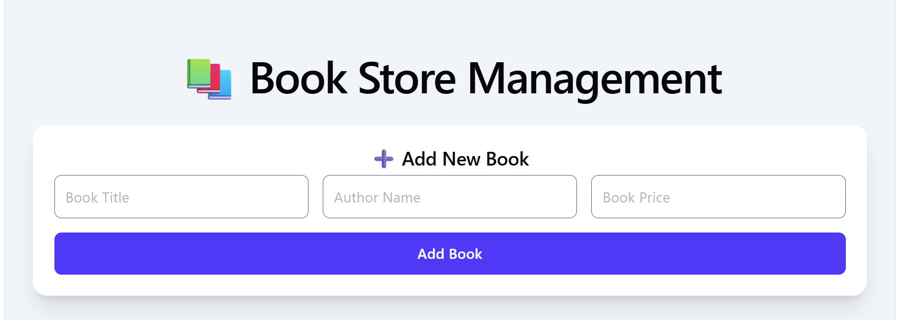
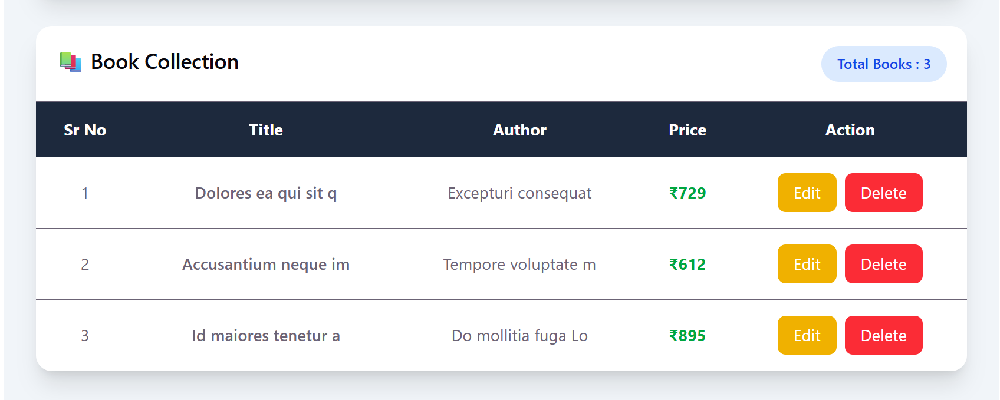
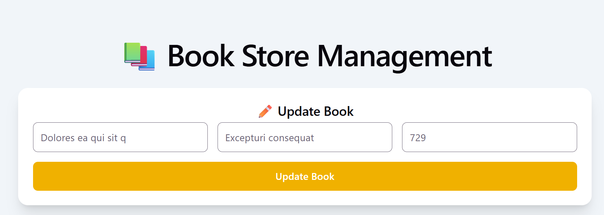

📚 Book Store Management System

A modern CRUD (Create, Read, Update, Delete) application built using React JS, Redux Toolkit, Firebase Realtime Database, Axios, and Tailwind CSS. This project allows users to manage book records efficiently with a clean and responsive user interface.

🎥 Project Demo

Video Explanation Link:
(Add your Loom / YouTube video link here)

GitHub Repository:
(Add your GitHub repository link here)

Live Demo:
(Add your Vercel / Netlify link here)

📌 Project Overview

The Book Store Management System is designed to perform complete CRUD operations on book data. Users can add new books, view all books, update existing records, and delete books when required. The application uses Firebase Realtime Database as the backend and Redux Toolkit for state management.

🚀 Features
Create Book
Add new book records
Store book details in Firebase Realtime Database
Instant UI update using Redux Toolkit
Read Books
Fetch all books from Firebase
Display data in a responsive table
Dynamic serial numbering
Update Book
Edit existing book details
Auto-fill form with selected book data
Update records in Firebase
Delete Book
Remove books from database
Confirmation popup before deletion
Real-time UI update
Form Validation
Required field validation
Price validation
Error messages
Invalid data prevention
UI Features
Responsive design
Modern dashboard layout
Tailwind CSS styling
Mobile-friendly interface
🛠️ Technologies Used
Technology	Purpose
React JS	Frontend Development
Redux Toolkit	State Management
Firebase Realtime Database	Backend Database
Axios	API Requests
Tailwind CSS	Styling
Vite	Build Tool
📂 Folder Structure
src
│
├── api
│   └── axiosInstance.js
│
├── app
│   └── store.js
│
├── feature
│   └── book
│       └── BookSlice.js
│
├── App.jsx
├── main.jsx
└── index.css
⚙️ Installation
Clone Repository
git clone your-repository-link
Install Dependencies
npm install
Start Development Server
npm run dev
📦 Required Packages
npm install axios
npm install react-redux
npm install @reduxjs/toolkit
npm install tailwindcss @tailwindcss/vite
🔥 Firebase Configuration
Create Firebase Project
Open Firebase Console
Create New Project
Enable Realtime Database
Select Test Mode
Database Rules
{
  "rules": {
    ".read": true,
    ".write": true
  }
}
Axios Configuration
import axios from "axios";

const axiosInstance = axios.create({
  baseURL:
    "https://your-project-id-default-rtdb.firebaseio.com",
});

export default axiosInstance;
🔄 Redux Flow
UI
 ↓
Dispatch Action
 ↓
Redux Toolkit Thunk
 ↓
Axios Request
 ↓
Firebase Database
 ↓
Redux Store Update
 ↓
UI Re-render
📋 CRUD Operations
Create
dispatch(createBook(formData));
Read
dispatch(getAllBooks());
Update
dispatch(
  updateBook({
    id,
    book: formData,
  })
);
Delete
dispatch(deleteBook(id));
📸 Screenshots
Add Book Form

Book List Table

Update Book

Delete Book

🎯 Learning Outcomes

Through this project, I learned:

React Hooks
useState
useEffect
Redux Toolkit
createSlice
createAsyncThunk
Firebase Realtime Database
Axios Integration
CRUD Operations
Form Validation
Tailwind CSS
State Management
API Handling
🔮 Future Improvements
Search Functionality
Pagination
Authentication
Dark Mode
Category Filters
Export to PDF
Book Images Upload
Dashboard Analytics
👨‍💻 Author

Name: Your Name

Course: React JS Development

Project: Book Store Management System

Technology Stack: React JS + Redux Toolkit + Firebase + Tailwind CSS

⭐ Conclusion

The Book Store Management System successfully demonstrates the implementation of CRUD operations using React JS, Redux Toolkit, Firebase Realtime Database, Axios, and Tailwind CSS. The project provides a clean user experience while showcasing modern frontend development practices and state management techniques.